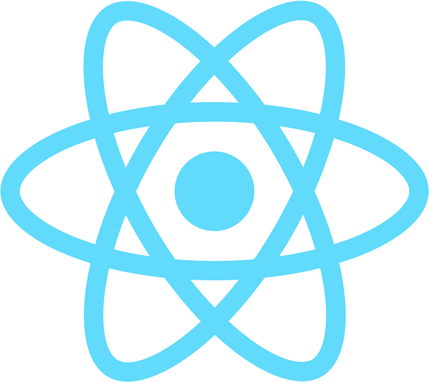
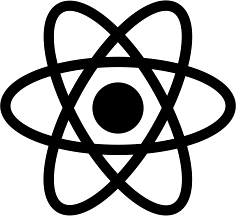
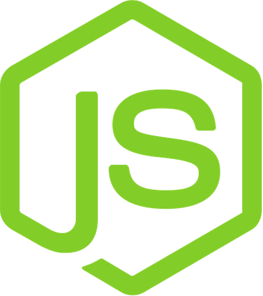
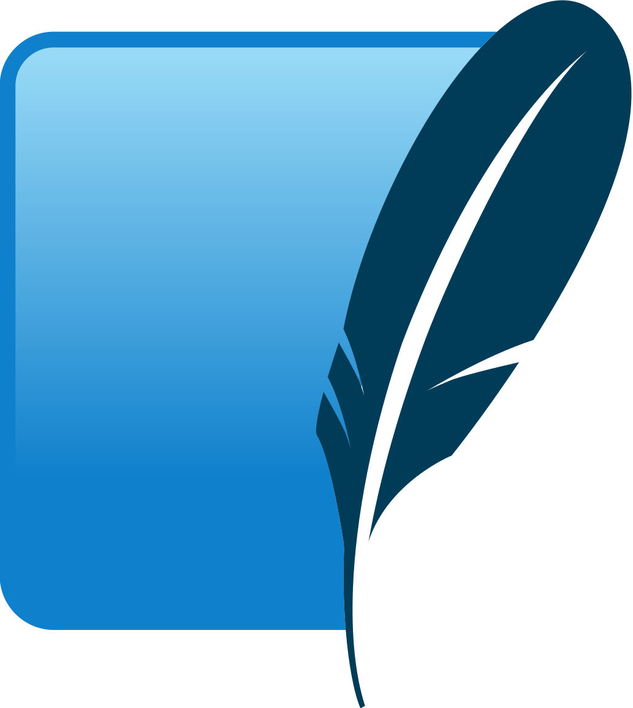
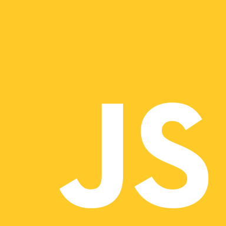
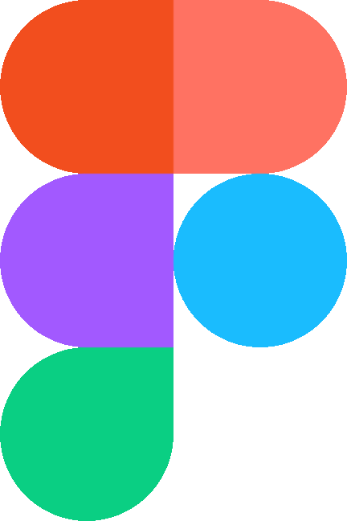
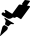

<!-- então bora codar! -->

<h1 align="center">
    
</h1>

<h2 align="center"> Aplicação para conectar ONGs e outras instituições a pessoas que tem disponibilidade de ajudar </h2>

<h3 align="center"> Criada com a stack  React,  React Native,  Node e  SQLite </h3>

<p align="center">  </p>

<p align="center"> Usando o poder de uma stack poderosa, que utiliza de uma única linguagem popular e moderna, o JavaScript. <br> Produtividade e performance de forma enxuta. </p>

---

A 11ª edição da Semana OmniStack, ocorrida entre 23/03 e 27/03 trouxe como projeto uma aplicação web e mobile inédita. Um sistema para conectar pessoas dispostas a ajudar a ONGs que precisam dessa ajuda.

Em uma semana foi desenvolvida uma aplicação do zero, dominando o backend, frontend e o mobile com uma única linguagem e uma única biblioteca de interfaces.

[Layout](https://www.figma.com/file/2C2yvw7jsCOGmaNUDftX9n/Be-The-Hero---OmniStack-11?node-id=0%3A1) da aplicação no  Figma.

**&copy;  [Rocketseat](https://rocketseat.com.br/)**

**Instrutor: [Diego Fernandes](https://github.com/diego3g) | CTO Rocketseat**

## Para rodar a aplicação

Execute ```npm install``` nas pastas backend, frontend e mobile, para instalar as dependências

Rode ```npm start``` nas pastas backend e frontend para utilizar a versão web. Acesse via **localhost:3000**

## Licença
[MIT](https://github.com/christyanbrayan/be-the-hero/blob/master/LICENSE)

---

<h4 align="center"> <em>&lt;/&gt;</em> by <a href="https://github.com/christyanbrayan" target="_blank">Christyan Brayan</a> </h4>
